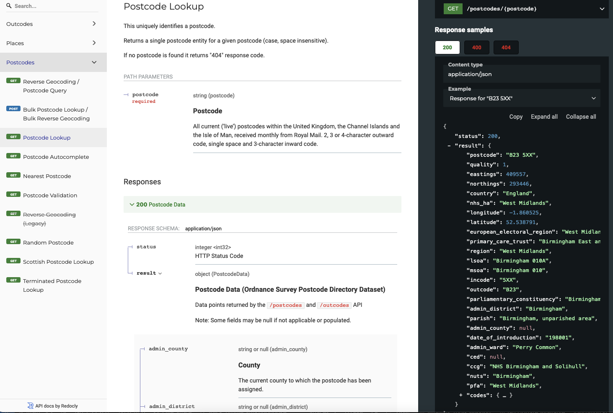

# postcodes.io-client

Client for the [postcodes.io](https://postcodes.io/) API from :octocat: [ideal-postcodes/postcodes.io](https://github.com/ideal-postcodes/postcodes.io) GitHub repo.


Features:

* supports the full REST API by a matching [OpenAPI](https://www.openapis.org/) specification
  * [REST API documentation](https://stevegoossens.github.io/docs/postcodes.io/) rendered by ReDoc
  * typed schemas for request and response
  * example requests and responses
  * includes undocumented properties
* package with types - supports use in TypeScript or JavaScript
* class method names match documented [API Methods](https://api.postcodes.io/docs#Methods)

# Table of Contents

<!-- toc -->

- [View REST API docs](#view-rest-api-docs)
- [Install from NPM repo](#install-from-npm-repo)
- [Usage](#usage)
  * [Instantiate class](#instantiate-class)
    + [Alternate: instantiate class to use different API server](#alternate-instantiate-class-to-use-different-api-server)
  * [Postcodes](#postcodes)
    + [Bulk Postcode Lookup](#bulk-postcode-lookup)
    + [Bulk Reverse Geocoding](#bulk-reverse-geocoding)
    + [Nearest Postcode](#nearest-postcode)
    + [Postcode Autocomplete](#postcode-autocomplete)
    + [Postcode Lookup](#postcode-lookup)
    + [Postcode Query](#postcode-query)
    + [Postcode Validation](#postcode-validation)
    + [Random Postcode](#random-postcode)
    + [Reverse Geocoding](#reverse-geocoding)
    + [Reverse Geocoding (Legacy)](#reverse-geocoding-legacy)
    + [Scottish Postcode Lookup](#scottish-postcode-lookup)
    + [Terminated Postcode Lookup](#terminated-postcode-lookup)
  * [Outcodes](#outcodes)
    + [Nearest Outcode](#nearest-outcode)
    + [Outcode Reverse Geocoding](#outcode-reverse-geocoding)
  * [Places](#places)
    + [Place Query](#place-query)
    + [Place Lookup](#place-lookup)
    + [Random Place](#random-place)
- [Development](#development)
  * [Install](#install)
  * [View api.postcodes.io REST API docs](#view-apipostcodesio-rest-api-docs)
  * [Validate OpenAPI](#validate-openapi)
  * [Generate code from OpenAPI](#generate-code-from-openapi)
  * [Test generated and source code](#test-generated-and-source-code)
  * [Build](#build)

<!-- tocstop -->

## View REST API docs

It is a good idea to view the REST API documentation to understand the
structure and property types. The `result` property from the API response body
is what is returned by the client methods.



You can view the REST API docs online at:

[https://stevegoossens.github.io/docs/postcodes.io/](https://stevegoossens.github.io/docs/postcodes.io/)

Alternatively, you can view them locally:

```
yarn docs
```

This will output a local URL that you can open in a browser to view the
documentation.

The original REST API documentation is at [https://api.postcodes.io/docs](https://api.postcodes.io/docs), but as at the time of writing it is slightly incomplete (a few properties are unmentioned or misnamed) and is harder to read than the ReDoc layout.

## Install from NPM repo

```
yarn add postcodes.io-client
```

## Usage

The package has one default export, the class `PostcodesIO`. You can
instantiate it without parameters to use the default settings (e.g. use
the normal `https://api.postcodes.io` server)

### Instantiate class

```typescript
import PostcodesIO from 'postcodes.io-client'
const postcodesIO = new PostcodesIO()
```
```javascript
const PostcodesIO = require('postcodes.io-client')
const postcodesIO = new PostcodesIO()
```

#### Alternate: instantiate class to use different API server

```typescript
const postcodesIO = new PostcodesIO({
  basePath: 'http://localhost:8000'
})
```

### Postcodes

#### Bulk Postcode Lookup

```typescript
const postcodes = ['BD6 3PS', 'NE32 5YQ']
const postcodeDataList =
    await postcodesIO.bulkPostcodeLookup(postcodes)
```

#### Bulk Reverse Geocoding

```typescript
const geolocations = [
  {
    longitude: 0.629834723775309,
    latitude: 51.7923246977375,
  },
  {
    longitude: -2.49690382054704,
    latitude: 53.5351312861402,
    radius: 1000,
    limit: 5,
  },
]
const postcodeDataReverseGeocodingResultList =
    await postcodesIO.bulkReverseGeocoding(geolocations)
```

#### Nearest Postcode

```typescript
const postcode = 'BH21 7AT'
const postcodeDataReverseGeocodingList =
    await postcodesIO.nearestPostcode(postcode)
```

#### Postcode Autocomplete

```typescript
const postcode = 'TA11 7Y'
const postcodes =
    await postcodesIO.postcodeAutocomplete(postcode)
```

#### Postcode Lookup

```typescript
const postcode = 'AB15 6DH'
const postcodeData =
    await postcodesIO.postcodeLookup(postcode)
```

#### Postcode Query

```typescript
const query = 'KT3'
const postcodeDataList =
    await postcodesIO.postcodeQuery(query)
```

#### Postcode Validation

```typescript
const postcode = 'CW6 0EF'
const postcodeIsValid =
    await postcodesIO.postcodeValidation(postcode)
```

#### Random Postcode

```typescript
const postcodeData =
    await postcodesIO.randomPostcode()
```

#### Reverse Geocoding

```typescript
const lon = -1.492787
const lat = 54.961017
const postcodeDataList =
    await postcodesIO.reverseGeocoding(
      lon,
      lat
    )
```

#### Reverse Geocoding (Legacy)

```typescript
const longitude = -3.924229
const latitude = 51.923369
const postcodeDataList =
    await postcodesIO.reverseGeocodingLegacy(
      longitude,
      latitude
    )
```

#### Scottish Postcode Lookup

```typescript
const postcode = 'EH22 3NX'
const scottishPostcodeData =
    await postcodesIO.scottishPostcodeLookup(postcode)
```

#### Terminated Postcode Lookup

```typescript
const postcode = 'E1W 1UU'
const terminatedPostcodeData =
    await postcodesIO.terminatedPostcodeLookup(postcode)
```

### Outcodes

#### Nearest Outcode

```typescript
const outcode = 'W1A'
const outcodeDataList =
    await postcodesIO.nearestOutcode(outcode)
```

#### Outward Code Lookup

```typescript
const outcode = 'B1'
const outcodeData =
    await postcodesIO.outwardCodeLookup(outcode)
```

#### Outcode Reverse Geocoding

```typescript
const lon = -2.302836
const lat = 53.455654
const outcodeDataList =
    await postcodesIO.outcodeReverseGeocoding(lon, lat)
```

### Places

#### Place Query

```typescript
const query = 'adl'
const placesDataList =
    await postcodesIO.placeQuery(query)
```

#### Place Lookup

```typescript
const code = 'osgb4000000074564391'
const placesData =
    await postcodesIO.placeLookup(code)
```

#### Random Place

```typescript
const placesData =
    await postcodesIO.randomPlace()
```

## Development

To develop this package, clone/fork this repo.

### Install

Download all NPM dependencies

```
yarn
```

### View api.postcodes.io REST API docs

You can view a complete documentation of the api.postcodes.io REST API, rendered with ReDoc, locally in a browser. This is useful if you need to update the `openapi.yaml` file, as the documentation should automatically reload in the browser (or you can refresh the browser page to load the updated OpenAPI spec file).

```
yarn docs
```

### Validate OpenAPI

The syntax and example data can be validated with OpenAPI linting.

```
yarn openapi:lint
```

### Generate code from OpenAPI

Generate TypeScript code from OpenAPI spec (of api.postcodes.io)

```
yarn generate
```

### Test generated and source code

This will run unit tests and test the code against linting rules via `posttest` script.

```
yarn test
```

### Build

Transpile to `dist/`

```
yarn build
```
